# Cozy Comfort - Design Diagrams

This document contains all design diagrams for the Cozy Comfort Service-Oriented Architecture system.

## Table of Contents
1. [System Architecture Diagram](#system-architecture-diagram)
2. [Service Communication Flow](#service-communication-flow)
3. [Sequence Diagram - Order Processing](#sequence-diagram---order-processing)
4. [Class Diagram - ManufacturerService](#class-diagram---manufacturerservice)
5. [Class Diagram - DistributorService](#class-diagram---distributorservice)
6. [Class Diagram - SellerService](#class-diagram---sellerservice)
7. [Database ER Diagrams](#database-er-diagrams)
8. [Deployment Architecture](#deployment-architecture)

---

## System Architecture Diagram

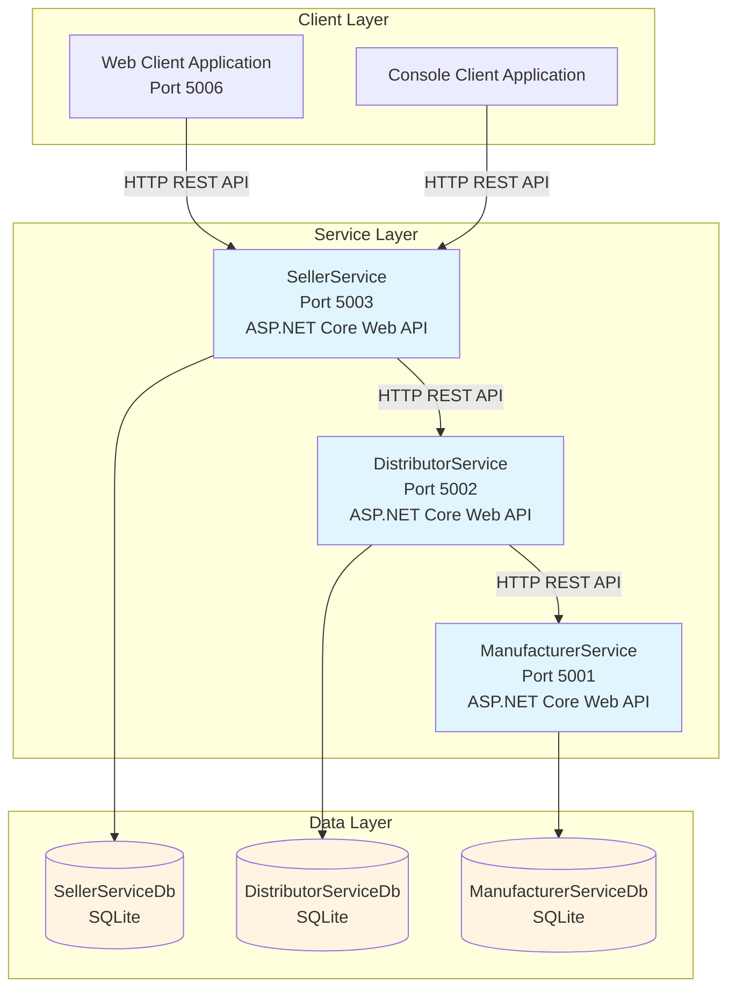

---

## Service Communication Flow

Per PDF: "Seller checks their own stock. If unavailable, they contact their assigned Distributor."

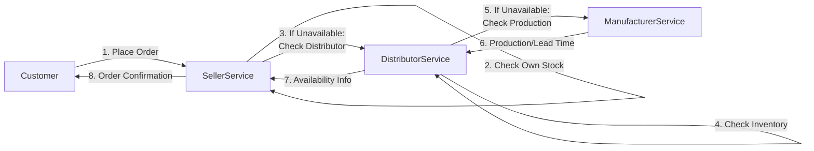

---

## Sequence Diagram - Order Processing

PDF flow: Seller checks own stock first; if unavailable, contacts Distributor; Distributor checks stock, then Manufacturer if needed.

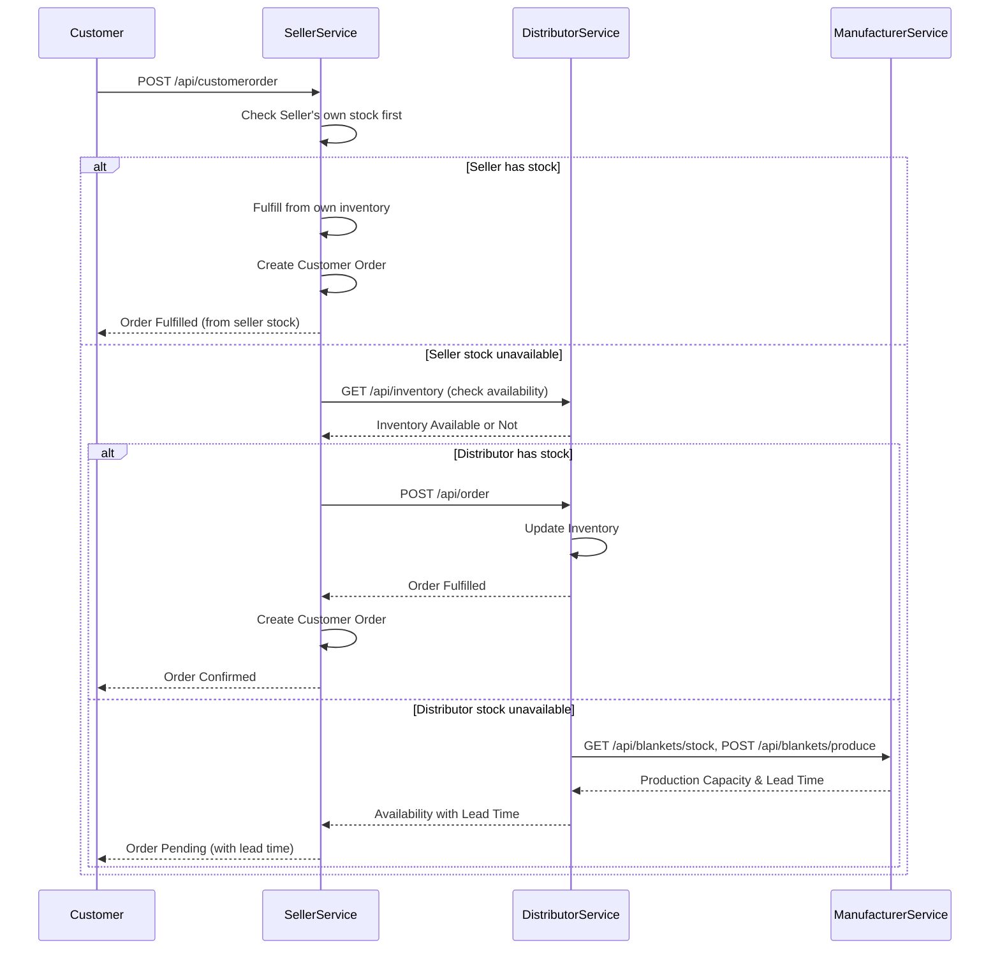

---

## Class Diagram - ManufacturerService

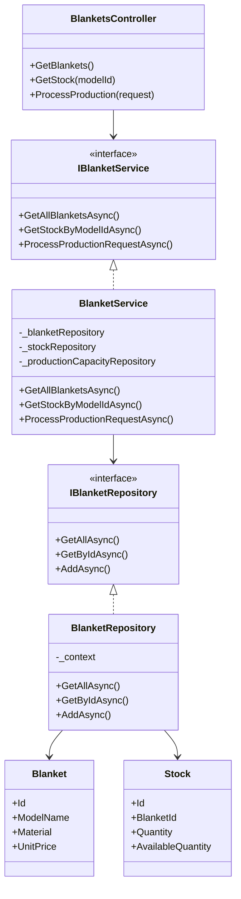

---

## Class Diagram - DistributorService

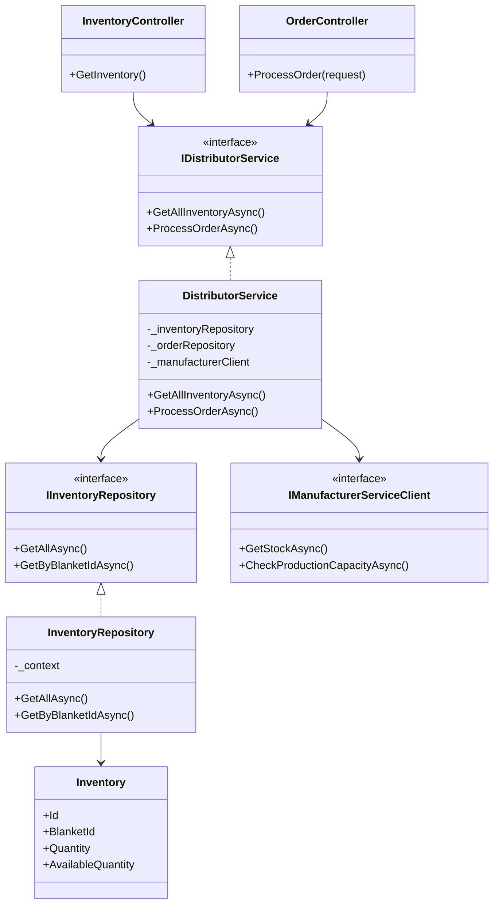

---

## Class Diagram - SellerService

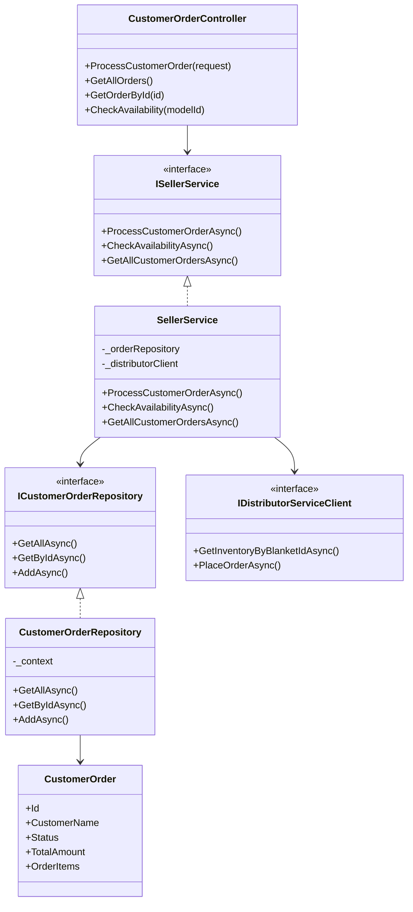

---

## Database ER Diagrams

### ManufacturerService Database

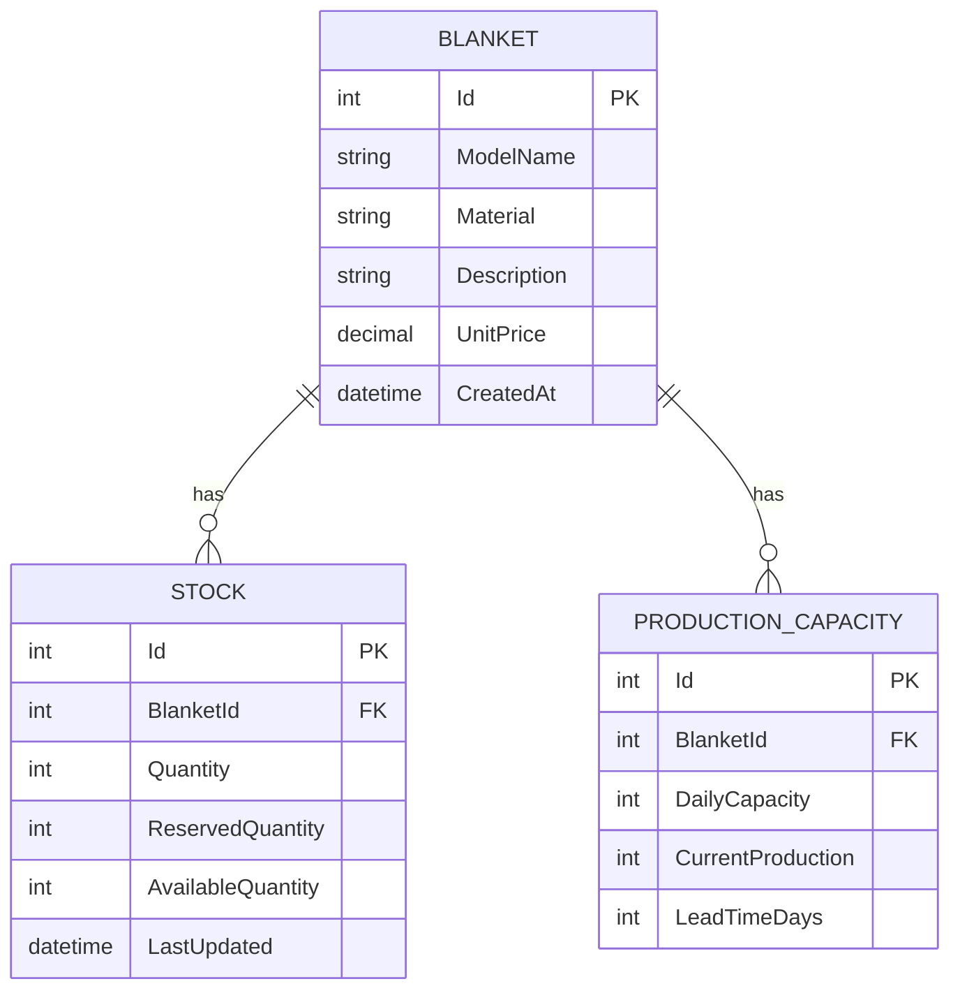

### DistributorService Database

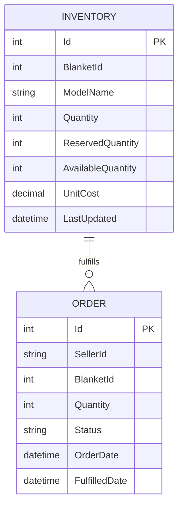

### SellerService Database

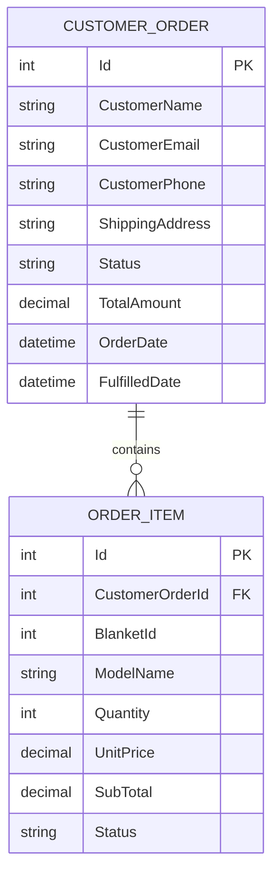

---

## Deployment Architecture

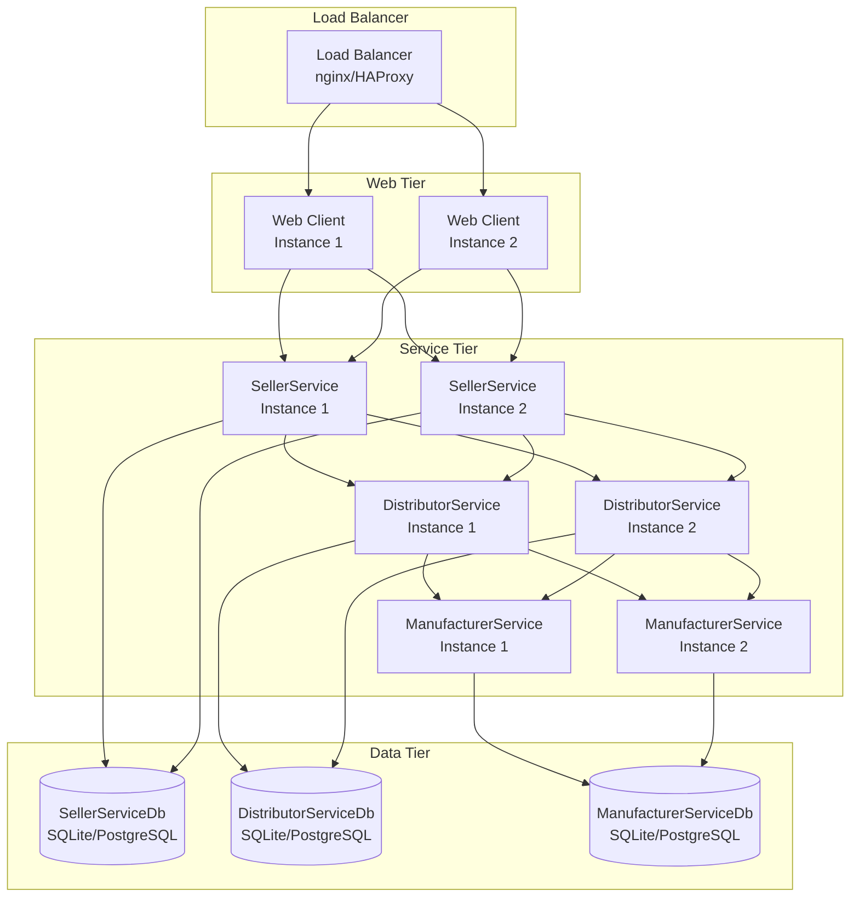

---

## Component Diagram

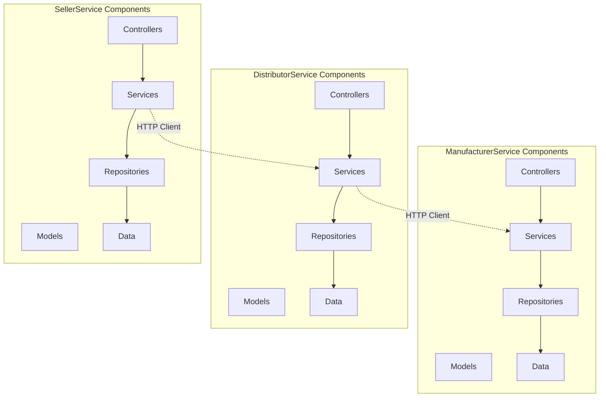

---

## Notes

- All diagrams use standard UML/Mermaid notation
- Services communicate via RESTful HTTP APIs
- Each service maintains its own database (Database per Service pattern)
- Services are loosely coupled and can be deployed independently
- The architecture supports horizontal scaling of each service
