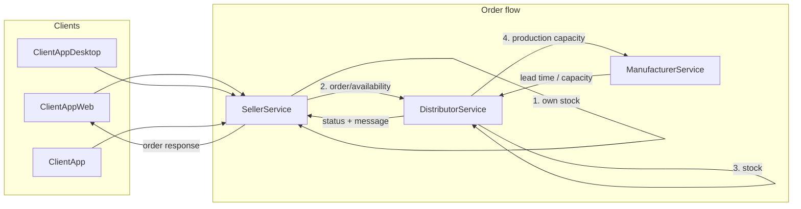

# Cozy Comfort — Workflow Overview

This document is the single-page reference for how orders flow through the system. For detailed mapping to business rules, see [BUSINESS_LOGIC.md](BUSINESS_LOGIC.md).

## Order flow (high level)

1. **Customer** places an order (via Web, Desktop, or Console client).
2. **SellerService** receives the order and, for each line item:
   - Checks **seller’s own stock** first.
   - If insufficient, calls **DistributorService** (availability and/or place order).
3. **DistributorService** checks its inventory; if insufficient, calls **ManufacturerService** for production capacity and lead time.
4. **ManufacturerService** returns capacity and lead time (information only; no stock commitment in this flow).
5. Response flows back: Manufacturer → Distributor → Seller → **Customer**.

Possible outcomes per order:

- **Fulfilled** — From seller stock and/or distributor stock.
- **Processing** — Some or all lines are pending manufacturer (lead time communicated; no automatic fulfillment when production completes).
- **Cancelled** — One or more lines unavailable and no pending manufacturer path.

## Workflow diagram

## Key APIs

| Step | Service | Endpoint | Purpose |
|------|---------|----------|---------|
| Place order | SellerService | `POST /api/customerorder` | Customer order with line items |
| Check availability | SellerService | `GET /api/availability/{modelId}` | Seller stock first, then distributor |
| Distributor order | DistributorService | `POST /api/order` | Seller requests stock from distributor |
| Production capacity | ManufacturerService | `POST /api/blankets/produce` | Lead time and capacity (info only) |

All workflows are aligned with this flow; see [BUSINESS_LOGIC.md](BUSINESS_LOGIC.md) for the full implementation mapping.
